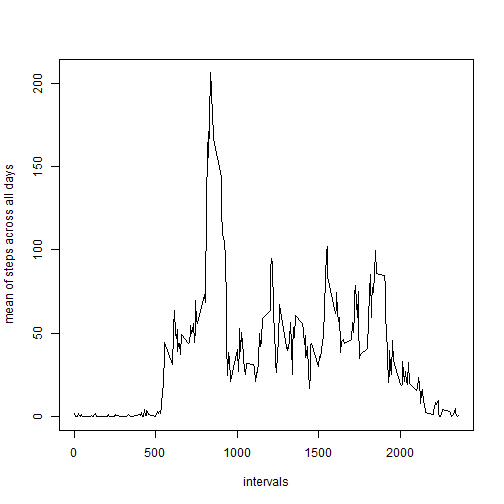

## 1.Loading and preprocessing the data


###1.1.downloading and creating file in csv format, reading it


```r
if(!file.exists("./activity.csv")){
    download.file("https://d396qusza40orc.cloudfront.net/repdata%2Fdata%2Factivity.zip","./data_activity.zip",method="auto")
    unzip("./data_activity.zip")
}
```

```
## Warning in
## download.file("https://d396qusza40orc.cloudfront.net/repdata%2Fdata%2Factivity.zip",
## : downloaded length 53559 != reported length 53559
```

```r
data <- read.csv("./activity.csv",header=TRUE)
```

###1.2.creating a data frame with steps grouped by day

```r
  data_by_day <- aggregate(steps ~ date,data,sum)
  data_by_day
```

```
##          date steps
## 1  2012-10-02   126
## 2  2012-10-03 11352
## 3  2012-10-04 12116
## 4  2012-10-05 13294
## 5  2012-10-06 15420
## 6  2012-10-07 11015
## 7  2012-10-09 12811
## 8  2012-10-10  9900
## 9  2012-10-11 10304
## 10 2012-10-12 17382
## 11 2012-10-13 12426
## 12 2012-10-14 15098
## 13 2012-10-15 10139
## 14 2012-10-16 15084
## 15 2012-10-17 13452
## 16 2012-10-18 10056
## 17 2012-10-19 11829
## 18 2012-10-20 10395
## 19 2012-10-21  8821
## 20 2012-10-22 13460
## 21 2012-10-23  8918
## 22 2012-10-24  8355
## 23 2012-10-25  2492
## 24 2012-10-26  6778
## 25 2012-10-27 10119
## 26 2012-10-28 11458
## 27 2012-10-29  5018
## 28 2012-10-30  9819
## 29 2012-10-31 15414
## 30 2012-11-02 10600
## 31 2012-11-03 10571
## 32 2012-11-05 10439
## 33 2012-11-06  8334
## 34 2012-11-07 12883
## 35 2012-11-08  3219
## 36 2012-11-11 12608
## 37 2012-11-12 10765
## 38 2012-11-13  7336
## 39 2012-11-15    41
## 40 2012-11-16  5441
## 41 2012-11-17 14339
## 42 2012-11-18 15110
## 43 2012-11-19  8841
## 44 2012-11-20  4472
## 45 2012-11-21 12787
## 46 2012-11-22 20427
## 47 2012-11-23 21194
## 48 2012-11-24 14478
## 49 2012-11-25 11834
## 50 2012-11-26 11162
## 51 2012-11-27 13646
## 52 2012-11-28 10183
## 53 2012-11-29  7047
```
  
###1.3.generating the histogram of total steps by day and computing mean and median of total steps by day

```r
  hist(data_by_day$steps,xlab="Total steps by day",col="blue",main="Histogram of Total steps by day")
```

 

## 2.What is mean total number of steps taken per day?

###2.1.computing mean and median of total steps by day

```r
  mean_steps_by_day <- mean(data_by_day$steps)
  median_steps_by_day <- median(data_by_day$steps)
  mean_steps_by_day
```

```
## [1] 10766.19
```

```r
  median_steps_by_day
```

```
## [1] 10765
```

## 3.What is the average daily activity pattern?

###3.1.creating a data frame with steps averaged by interval and plotting the result

```r
  data_by_interval <- aggregate(steps ~ interval,data,mean)
  
  ##plotting the result
  plot(data_by_interval$interval,data_by_interval$steps,type="l",xlab="intervals",ylab="mean of steps across all days")
```

 

###3.2.finding the interval with maximum steps

```r
  interval_with_max_steps <- data_by_interval[data_by_interval$steps==max(data_by_interval$steps),1]
  interval_with_max_steps
```

```
## [1] 835
```
  
##4.inputting missing values

###4.1.counting NA's

```r
  na_number <- sum(is.na(data))
  na_number
```

```
## [1] 2304
```
  
###4.2.Replace NA's with the mean for the specific interval  

The chosen strategy is replacing NA's with the mean value of steps for the specific interval considered


```r
  ##Firstly I found where NAs are
  data_new <- data
  ind_na <- is.na(data[,1])
```

###4.3.creating a new data frame with steps grouped by day

```r
  data_new[ind_na,1] <- data_by_interval[,2]
  

  data_new_by_day <- aggregate(steps ~ date,data_new,sum)
  data_new_by_day
```

```
##          date    steps
## 1  2012-10-01 10766.19
## 2  2012-10-02   126.00
## 3  2012-10-03 11352.00
## 4  2012-10-04 12116.00
## 5  2012-10-05 13294.00
## 6  2012-10-06 15420.00
## 7  2012-10-07 11015.00
## 8  2012-10-08 10766.19
## 9  2012-10-09 12811.00
## 10 2012-10-10  9900.00
## 11 2012-10-11 10304.00
## 12 2012-10-12 17382.00
## 13 2012-10-13 12426.00
## 14 2012-10-14 15098.00
## 15 2012-10-15 10139.00
## 16 2012-10-16 15084.00
## 17 2012-10-17 13452.00
## 18 2012-10-18 10056.00
## 19 2012-10-19 11829.00
## 20 2012-10-20 10395.00
## 21 2012-10-21  8821.00
## 22 2012-10-22 13460.00
## 23 2012-10-23  8918.00
## 24 2012-10-24  8355.00
## 25 2012-10-25  2492.00
## 26 2012-10-26  6778.00
## 27 2012-10-27 10119.00
## 28 2012-10-28 11458.00
## 29 2012-10-29  5018.00
## 30 2012-10-30  9819.00
## 31 2012-10-31 15414.00
## 32 2012-11-01 10766.19
## 33 2012-11-02 10600.00
## 34 2012-11-03 10571.00
## 35 2012-11-04 10766.19
## 36 2012-11-05 10439.00
## 37 2012-11-06  8334.00
## 38 2012-11-07 12883.00
## 39 2012-11-08  3219.00
## 40 2012-11-09 10766.19
## 41 2012-11-10 10766.19
## 42 2012-11-11 12608.00
## 43 2012-11-12 10765.00
## 44 2012-11-13  7336.00
## 45 2012-11-14 10766.19
## 46 2012-11-15    41.00
## 47 2012-11-16  5441.00
## 48 2012-11-17 14339.00
## 49 2012-11-18 15110.00
## 50 2012-11-19  8841.00
## 51 2012-11-20  4472.00
## 52 2012-11-21 12787.00
## 53 2012-11-22 20427.00
## 54 2012-11-23 21194.00
## 55 2012-11-24 14478.00
## 56 2012-11-25 11834.00
## 57 2012-11-26 11162.00
## 58 2012-11-27 13646.00
## 59 2012-11-28 10183.00
## 60 2012-11-29  7047.00
## 61 2012-11-30 10766.19
```

###4.4.generating the histogram of total steps by day 

```r
  hist(data_new_by_day$steps,xlab="Total steps by day",col="blue",main="Histogram of Total steps by day")
```

 

```r
  ##computing mean and median of total steps by day
  mean_new_steps_by_day <- mean(data_new_by_day$steps)
  median_new_steps_by_day <- median(data_new_by_day$steps)
  mean_new_steps_by_day
```

```
## [1] 10766.19
```

```r
  mean_new_steps_by_day
```

```
## [1] 10766.19
```
As we can see, now the mean and the median are exactly the same. This is possible because we have introduced mean values instead of missing values.

## 5.Are there differences in activity patterns between weekdays and weekends?


```r
  ##creating a new column indicating if it's a weekday
  days <- data_new[,2]
  Sys.setlocale("LC_TIME", "English")
```

```
## [1] "English_United States.1252"
```

```r
  weekday <- weekdays(as.Date(days))
  weekday[weekday=="Monday"] <- "weekday"
  weekday[weekday=="Tuesday"] <- "weekday"
  weekday[weekday=="Wednesday"] <- "weekday"
  weekday[weekday=="Thursday"] <- "weekday"
  weekday[weekday=="Friday"] <- "weekday"
  weekday[weekday=="Saturday"] <- "weekend"
  weekday[weekday=="Sunday"] <- "weekend"
  
  ##adding the new variable to the dataframe
  data_new$weekday <- weekday
  
  ##Making new groups weekday + interval by mean operation across days
  data_by_weekdays <- aggregate(data_new$steps, by=list(data_new$interval,data_new$weekday),mean)
  
  colnames(data_by_weekdays) <- c("interval","weekday","steps")

  library(lattice)
  
 xyplot(data_by_weekdays$steps~data_by_weekdays$interval | data_by_weekdays$weekday,type="l",layout=c(1,2),xlab="Interval",ylab="Number of steps")
```

 

As we can see on the figures above, activity starts early at weekdays, with a clear peak placed on the rush hour where people tend to go towards their workplaces, schools, college...

On weekends, activity starts later and is more equally distributed along the whole day
